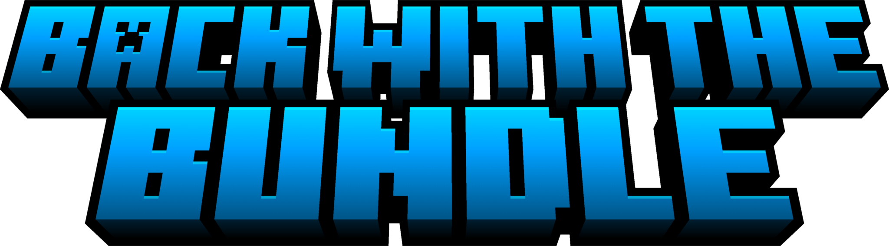
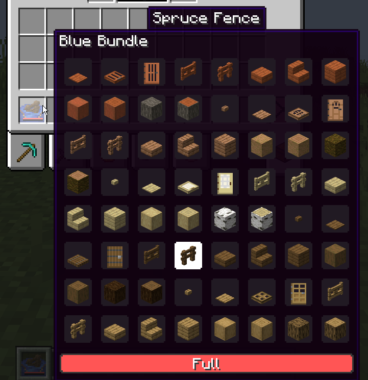
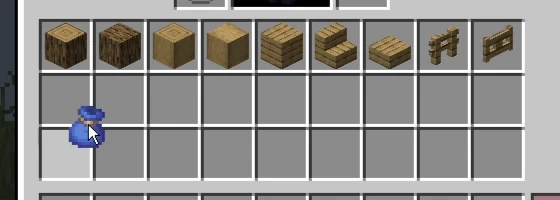

A faithful backport of all the modern bundle features to 1.21.1. Includes:

- Updated UI and controls
- Dyed bundles
- Bundles open and display the selected item
- Crafting recipes
- Bundles as loot in village chests

## Additional Features

These quality-of-life features are client-configurable and can be disabled individually at any time in the config menu.

### Expanded Bundle Tooltips

Displays every item stored in a bundle, and allows selecting any of them using the scroll wheel.

### Bundle Drag Controls

Drag a bundle across inventory slots to insert or remove items.

## Notes

- This mod does not require the experimental bundles feature flag.
- This mod is required on both the client and server.
- Requires NeoForge. Support for other mod loaders is not planned.

## Compatibility

**[Easy Shulker Boxes](https://www.curseforge.com/minecraft/mc-mods/easy-shulker-boxes):** Back with the Bundle handles bundle interactions and tooltips by default. To use Easy Shulker Boxes for those features instead, install the [Back with the Bundle + Easy Shulker Boxes Compat](datapacks/Back_with_the_Bundle_Easy_Shulker_Boxes_Compat-v1) data pack. Note that while the data pack is enabled, bundles will not open and display the selected item.
